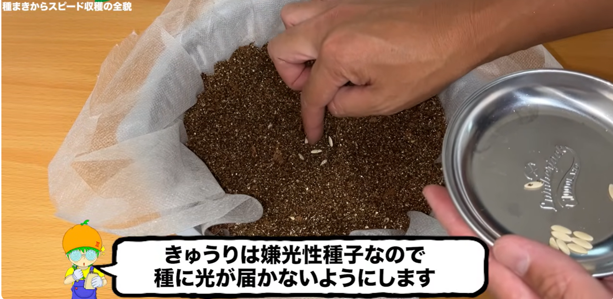

# 栽培方法メモ - きゅうり

## 参考動画

みかんぼーやチャンネル

[【超スピード収穫】バケツできゅうりを水耕栽培したら早くたくさん収穫出来ました！種まきから撤収まで全部お見せします！](https://www.youtube.com/watch?v=BI4TGZKQW_8)

概要：

夏といったらきゅうりでしょ！という事で場所が全くない我が家でもたくさん収穫できたバケツ水耕栽培の方法を共有致します！畑も土も使わずに少ないスペースで育てられ、種まきから収穫までとても早く育てることができました。もしかしたらきゅうりと水耕栽培の相性が良いのかもしれません。この動画では容器作りから種まき収穫まで細かく解説しておりますので是非最後まで見てください！

この動画が1つのサンプルとして皆様の家庭菜園ライフに何かしらの参考になれば幸いです。

【安心して美味しく水耕栽培する為に】
余分な窒素を使い切るように収穫の２〜３日前に液体肥料を水だけに変えるとえぐみが無くなり風味が増し美味しくなります。
容器の劣化を防ぐ為に、直射日光が当たらないようにアルミシートを貼るなどして劣化を防ぎましょう。ペットボトルやプラカップ、空き缶などは長期栽培の劣化を考慮してたまに容器ごと交換します。
バケツやゴミ箱はポリ袋を容器の内側に敷き、その中に養液を入れるようにすると劣化を防ぎ、洗う手間が無くなります。ポリ袋は食品用になっているものを選ぶと安心です。

防虫ネット作成動画↓
   • 家庭菜園アイデア｜DAISOグッズで防虫ネットの作り方｜水耕栽培時に便利｜超簡単作成  

ーーーーーーーーー容器で使用したものーーーーーーーー
・DAISO種早生節成きゅうり
・DAISO取手に雑巾が干せる蓋付きバケツ８L JAN:4549131987959
・DAISO水切りザル２重タイプJAN:4549131933567
・DAISOバーミキュライトJAN:4979909937242
・DAISO不織布シート
・DAISOアルミ保温シート

ーーーーーーー実際にこれ買って使ってますーーーーーー
https://www.amazon.co.jp/shop/1987
私のストアです！実際に使用してるアイテムを見ることが出来ます！
買うこともできまーす！！見ていってね！
売り切れ等、エラーがありましたら是非お申し付けください。

## 全体スケジュール

### 動画のスケジュール

- 7/23 種まき（もう少し早くても良さそう）

### スケジュールについて

本来は4～7月ころが適切らしい。

オクラと同様、25～30℃が発芽適温。

### 実績スケジュール

## 必要なもの

### リスト

### 補足

## フロー

### 土

- 不織布を敷く。いったん広めに敷いておいて、後からいい感じにふちを切る。
- バーミキュライトと、かさ増しでココヤシピート。バーミキュライト3：ココヤシピート2くらい。
    - ココヤシピートは、ココナッツの殻（ハスク）を粉砕・発酵させた天然の有機質培土。水で膨らむ圧縮ブロック状が人気。
- ペットボトルのふたで穴の位置を決め、5粒播種。嫌光性種子なので、上から土をかぶせる。

