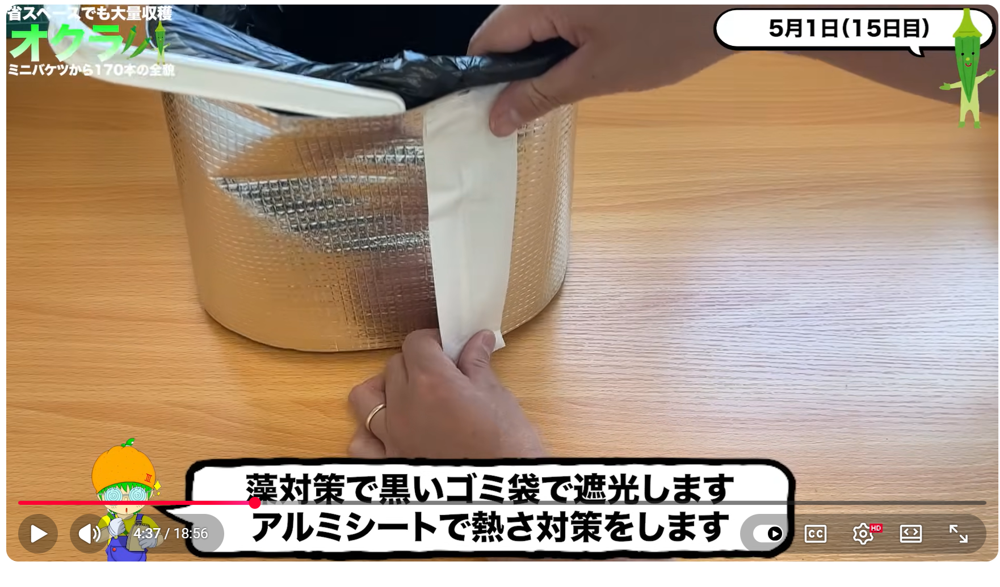
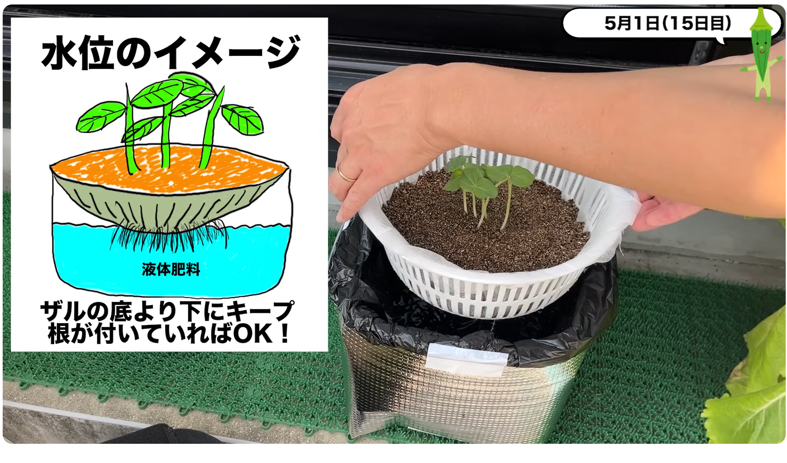
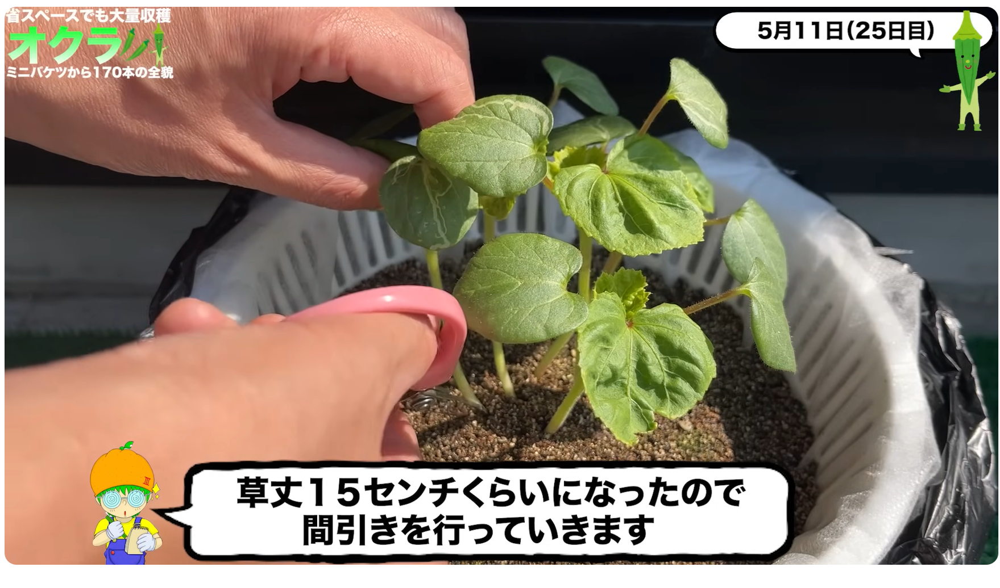
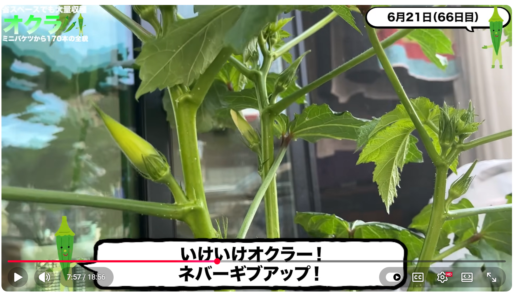
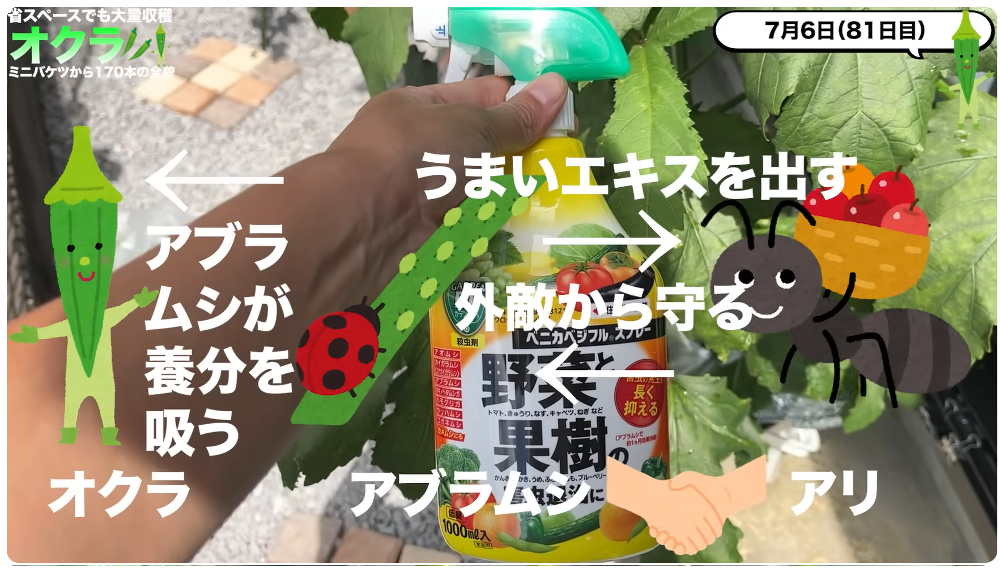

# 栽培方法メモ - オクラ

## 参考動画

みかんぼーやチャンネル

[【採れすぎ注意】オクラをミニバケツで水耕栽培したら170本収穫出来ました！How to Grow 170+ Okra with Bucket Hydroponics](https://www.youtube.com/watch?v=1O5gjXAf5RA)

概要：

夏の大人気野菜オクラを大量に収穫しました！場所が無くても畑が無くても小さなバケツと陽当たりが良い場所があればオクラはこんなに簡単に大量収穫できちゃうんです！この夏ネバネバしたい方は是非チェックしてくださいね！種まきから生育方法、収穫、実食まで細かく解説しております！また、お気に入りのレシピも公開していますので是非最後までみてくださいね！

この動画が1つのサンプルとして皆様の家庭菜園ライフに何かしらの参考になれば幸いです。

【安心して美味しく水耕栽培する為に】
余分な窒素を使い切るように収穫の２〜３日前に液体肥料を水だけに変えるとえぐみが無くなり風味が増し美味しくなります。
容器の劣化を防ぐ為に、直射日光が当たらないようにアルミシートを貼るなどして劣化を防ぎましょう。ペットボトルやプラカップ、空き缶などは長期栽培の劣化を考慮してたまに容器ごと交換します。
バケツやゴミ箱はポリ袋を容器の内側に敷き、その中に養液を入れるようにすると劣化を防ぎ、洗う手間が無くなります。ポリ袋は食品用になっているものを選ぶと安心です。

防虫ネット作成動画↓
   • 家庭菜園アイデア｜DAISOグッズで防虫ネットの作り方｜水耕栽培時に便利｜超簡単作成  

ーーーーーーーーー容器で使用したものーーーーーーーー
・ダイソー早生オクラJAN:4550480313016
・DAISO取手に雑巾が干せる蓋付きバケツ8L JAN:4549131987959
・DAISO水切りザル2重タイプJAN:4549131933567
・DAISOバーミキュライトJAN:4979909937242
・DAISO不織布シート
・DAISOアルミ保温シート

ーーーーーーー実際にこれ買って使ってますーーーーーー
[Amazonストア](https://www.amazon.co.jp/shop/1987)

私のストアです！実際に使用してるアイテムを見ることが出来ます！
買うこともできまーす！！見ていってね！
売り切れ等、エラーがありましたら是非お申し付けください。

mikanbo-ya1987家庭菜園は、Amazon.co.jpを宣伝しリンクすることによってサイトが紹介料を獲得できる手段を提供することを目的に設定されたアフィリエイトプログラムである、Amazonアソシエイト・プログラムの参加者です。

## 全体スケジュール

### 動画のスケジュール

- 4/16 発芽作業開始(室内) → 5日ほどで発芽、屋外へ
- 4/22 液体肥料に変更
- 5/1 鉢上げ 
- 5/11 間引き
- 6/13 防虫ネットを外した
- 6/28 開花
- 7/2 初収穫
- 7/6 アリが寄り始める
- 7/15 溶液を入れ替える（本来は月1でやった方が良い）
- 7月 合計36本収穫
- 8月 合計40本収穫 脇芽が生えてくる
- 9月 合計54本収穫
- 10月 合計26本収穫
- 11月 合計17本収穫 身長が高くなりすぎ
- 12月 2本収穫 合計170本 10℃以下で成長停止

### 実際のスケジュール

- 4/12にいったん播種するも、日陰においておいたところ土温度が足りず発芽せず。4/19に仕切り直し。

## 必要なもの

### リスト

ダイソー（防虫ネット）

- 毛布用洗濯ネット 42x54cm 糸くずガードタイプ ← 防虫ネットの役目
- ホッピングバッグ ←骨組みの役目

ダイソー

- 早生オクラの種（2個100円）
- 取っ手に雑巾が干せる蓋つきバケツ(8L)（200円）
- 水切りざる2重タイプ（200円）
- 多用途不織布シート
- バーミキュライト2L
- 黒ゴミ袋30L
- 遮光アルミシート

ホームセンター
- メネデール
- 微粉ハイポネックス

### 補足

メネデール
: 発芽を促す肥料。鉄を2価のイオンとして含む植物活力素で、主に発根促進と傷ついた組織の保護に作用する。植物が吸収しやすいイオン状態の鉄分が水分・養分の吸収を助け、代謝を活性化して光合成を活発にし、根の成長を促進する。

微粉ハイポネックス
: 水耕栽培に最適なカリ分（K）が豊富な粉末肥料。1000倍に薄めて使用する。1週間に1回程度入れ替えると良い。

## フロー

### 容器の加工

#### ざる

- 真ん中をくりぬく
- 不織布をぴったり張る（上部のみ）
- バーミキュライトを入れる（7割くらいまで）

#### 受け皿側

- 水を入れる（発芽までは水）
- メネデールを入れる

#### 合体

- ボウルに水を入れて培地を湿らせる
- 5粒くらい種まき
- 上からバーミキュライトをかける
- 遮光性種子のため、アルミホイルをかけて遮光する

### 発芽

- 上記から例として5日程度で発芽する。
- 発芽適温は25～30℃で、20℃以下だとかなり鈍る。
- 通常の栽培では1～2cmの覆土を行う。
- 直根性で、かなり早い段階からざるを突き抜けて下に出る。

### 水から液体肥料に切り替え

- 1000倍希釈
- 減ったら継ぎ足す形。培地をびちょびちょにしないように。
- バケツにはまだ切り替えない。
- 徒長（茎や枝が必要以上に長く伸びる。細胞壁が薄くなり病気に弱くなる）しないよう、日当たりのよいところに移動。

### 鉢上げ

#### バケツ鉢の加工

- 黒いゴミ袋をかぶせ、さらにアルミシートを巻く。
- 黒い袋は藻が発生しにくくなるように、
- アルミシートはバケツの加熱を抑えるため。

- バケツの真ん中より少し上に排水用の穴を空ける。（動画では実施していない）
    - ゴミ袋にも穴を空ける？　肥料液から保護するという話だったような…
    - アルミシートにも干渉するのでは…？　サイフォンで排水する？
- 根が少し液体肥料に届くくらいの水位になるよう、液体肥料を入れてザルをその上に移動させる。
- 液体試料はザルには付着しないようにする。

### 間引き

- 草丈15cmくらいになったら間引き作業を行う。
- 地面ギリギリでカットする。残った根は有機物に分解される。

- 1本残すタイプも多いが、オクラは3～4本残しておくのが良い。(密植栽培)
    - 収穫量が増える
    - 採り遅れるリスクが減る(栄養分を奪い合い、育つのが少し遅くなる)
    - 茎が細くしなやかになり、風に強くなる

### 肥料濃度と照度の評価

- ミニトマトなどは生育中期から濃度を上げると良いが、オクラの場合は窒素過多で花芽がつきにくくなったりする。
- 動画ではいったん上げたが、戻した。
- 肥料濃度は電気伝導度（EC）で管理する。
    - [ESP32などから制御するモジュール](https://www.switch-science.com/products/4028)もあるが、漬けっぱなしは良くないとのことで、難易度高め。
    - [ハンディタイプ](https://www.amazon.co.jp/dp/B01ENFOIPK)で測定したいときに測定するようにする。

- 防虫ネットで日よけしていたが、照度30000では不足。（ネット外は15万など）
    - 防虫ネットをしないと、アリが来て、アブラムシを連れてくる。

- このあたりで、アルミシートを全体にかけている。

### 収穫

- 6月末に開花を確認。
- 花が落ちて1週間くらいで収穫可能になる。

### アリ対策

## トラブルシューティング

### 発芽

オクラは土の温度が25～30℃くらいないと発芽しない。
春でそこそこ暖かくても、温まらない日陰では発芽しない。また、発芽しないままだと種が腐ってしまう。

