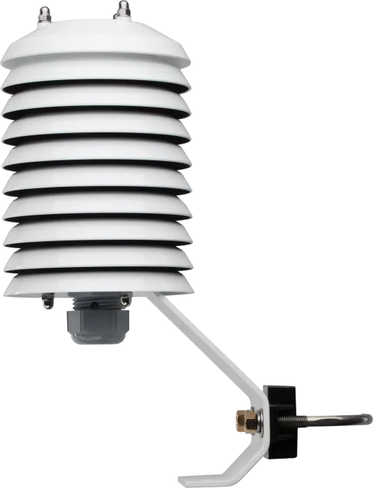
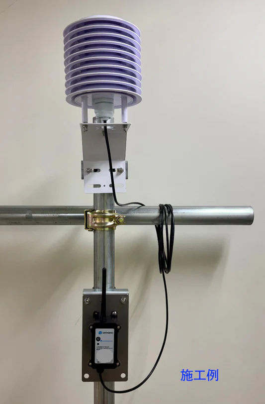
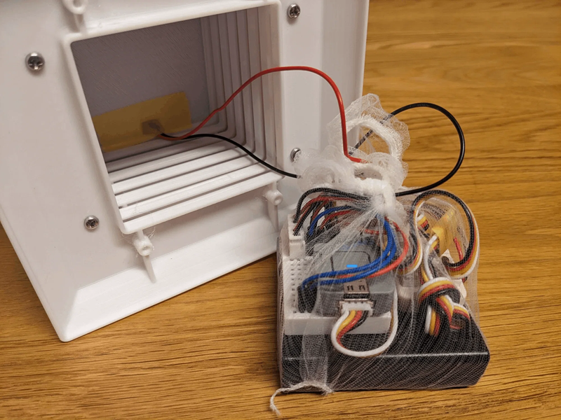

# 環境を測定する - ラジエーションシールド

## 概要

ラジエーションシールドは「直射日光を遮りつつ、空気は通すカバー」。

白い皿が下向きに何枚も重なった構造をしており、その中にセンサを設置する。

空気の流れはあるが、雨は入ってこない（暴風雨ではやられる）。太陽光は白いことで反射したりする。

## どうしたか

まともなものを買うと相当高く、数万円する。

DIYとしては植木鉢の皿をひっくり返し、少し間隔を開けて重ねて固定する方法もある、が、中をくりぬいたりするのがとても大変そう。

アリエクスプレスで4,000円くらいのがあったので、とりあえずそれを買ってみる。

